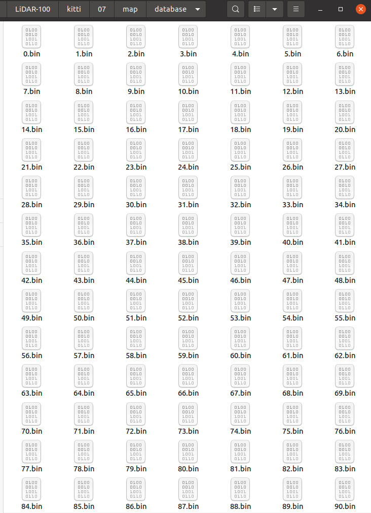
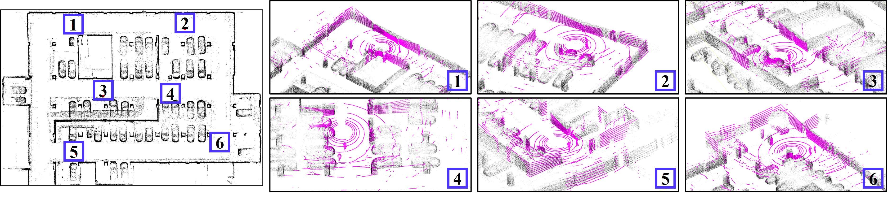
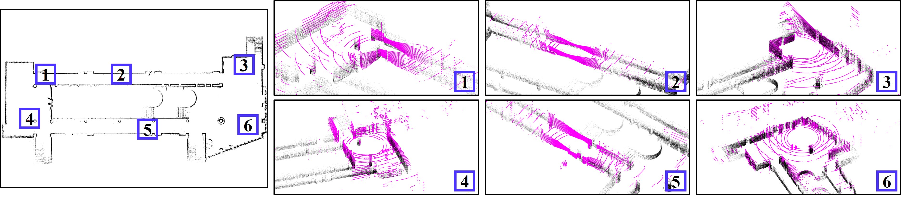

# LiDAR_Localization_100FPS
**LiDAR_Localization_100FPS**, referred to as **LiDAR-100**, is a global localization or relocalization solution that leverages a point cloud map and a single LiDAR scan. It is specifically designed to efficiently restore the global 3-DOF pose of a robot that has been kidnapped or lost.

This method adopts an **offline-online** approach, where maps are created and the database is collected offline once, enabling multiple instances of online relocalization.

> **Note:**  The current version eliminates KD trees, which slightly impact relocalization efficiency.
---

<p align="center">
    
</p>

---
##  Citation
If you use code or data of **LiDAR-100** in your academic research, please cite our paper:
```
@article{shi2023lidar,
  title={LiDAR localization at 100 FPS: a map-aided and template descriptor-based global method},
  author={Shi, Pengcheng and Li, Jiayuan and Zhang, Yongjun},
  journal={International Journal of Applied Earth Observation and Geoinformation},
  volume={120},
  pages={103336},
  year={2023},
  publisher={Elsevier}
}
```
## Test Environments
```
- Ubuntu 20.04
- ROS noetic
- PCL
- Eigen
- OpenMP
```
## File Structure
Using KITTI as an example, despite issues with the correction file, it is utilized to convert the camera pose to the LiDAR-centered coordinate system for comparison consistency.

1. **KITTI dataset**
```
├── kitti
│   └── 07
│       ├── lidar_pose.txt
│       ├── times.txt
│       └── velodyne
│             ├──  000000.bin
│             ├──  000001.bin
│             └──  ...
```
> **Note:** In lidar_pose.txt, each row represents a LiDAR-centered pose in KITTI format, i.e., a 3x4 matrix.

2. **Map directory**
A "database" subdirectory should be created within the "map" directory, and all files generated during offline map processing will be stored within these directories.
```
├── kitti
│   └── 07
│       └── map
│           ├── candidate_pts.pcd 
│           ├── pass_map.pcd
│           ├── raw_map.pcd
│           └── database
│                  ├── 0.bin
│                  ├── 1.bin
│                  ├── ...
│                  └── 1600.bin
```

## Run the package
1. **download and build the code** 
```
$ git clone https://github.com/ShiPC-AI/LiDAR-Localization-100FPS
// move the folder to your catkin/src/
// cd the folder of catkin
$ catkin_make
```
> **Note:** Prepare the KITTI or other datasets beforehand.

2. **offline mapping** 
```
$ roslaunch lidar_100 mapping.launch
// a new terminal 
$ roslaunch lidar_100 play_kitti_for_mapping.launch
```
<p align="center">
    
</p>

> **Note:** The purple represents **virtual points** generated from the ground, while the others denote map points.

3. **offline collecteing database**: 
```
// a new terminal
$ roslaunch lidar_100 collect_database.launch
```
<p align="center">
    <div style="display: flex; justify-content: center; gap: 20px;">
        
        
    </div>
</p>

> **Note:**  The left side shows the terminal output of the "collect database", while the right displays a portion of the map database.
4. **online relocalization**
```
$ roslaunch lidar_100 relocate.launch
// Wait for RViz to load the map (about 1 second)
// a new terminal
$ roslaunch lidar_100 play_kitti_for_relocate.launch
```
## Other Examples
1. **KITTI 06**
<p align="center">
    
</p>

2. **Parking Lot**
<p align="center">
    
</p>

3. **Corridor**
<p align="center">
    
</p>

## Acknowledgments

Thanks for [linefit](https://github.com/lorenwel/linefit_ground_segmentation).

